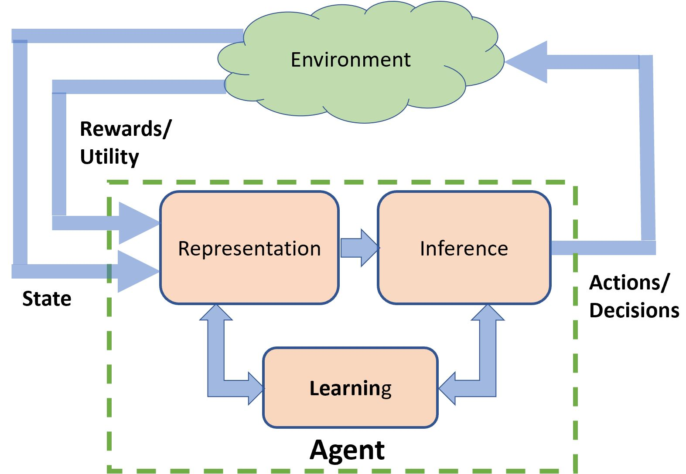
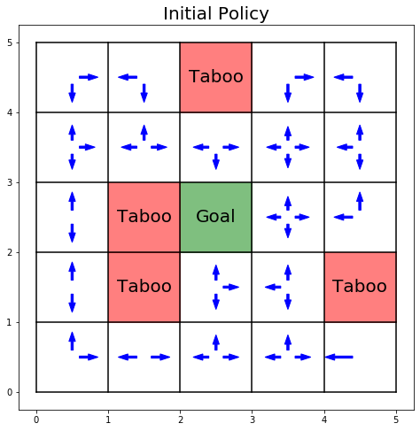
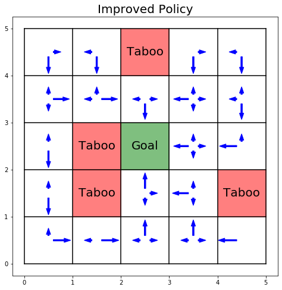

# Probabilistic_Programming

Use Monte-Carlo Reinforcement Learning algorithms to develop a navigational guide for an agent.
The simulation involves a customizable grid world.
The agent learns to take intelligent steps towards the goal, based on user-defined reward incentives.

**Note: While changing the random seed, you need to verify that the randomly generated taboo states cannot separate the grid world into "islands"! The grid world can be visualized by calling the 'plot_policy' function.**

Lengths of the arrows indicate the propensities to take corresponding directions. The improved policy serves as a well-informed navigational guide for the agent.

